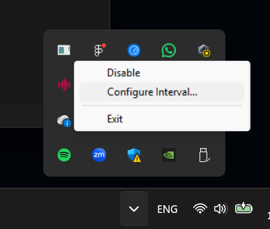

Prolonged eye strain and looking at a computer screen for a prolonged period is a common source of fatigue and worsened
vision. The easiest way to save your eyes is to follow the 20-20-20 rule: every 20 minutes, take a 20-second break and
look at something 20 feet away (>6 meters). TwentyWare Iris reminds you to take these breaks without distrupting your
workflow. It gently fades your screen to black for a second every 20 minutes, which is enough for being reminded, but
not too distruptive, so you can finish what you are doing in a couple of seconds and then take your 20-second break.

The length of the break is up to you, you can count in your head or stop as you feel.

> Note: When looking at the screen, we tend to blink less frequently, which dries out the eyes and also contributes to
> fatigue. You can also take the opportunity to drink a sip of water during your break.

## Installation

Download the latest standalone executable from the [releases page](https://github.com/twentyware/iris/releases).
To start the program on Windows startup, you can create a shortcut to the executable in the following folder:
`%appdata%\Microsoft\Windows\Start Menu\Programs\Startup`.

## Configuration

Once the app is started, you can configure the interval length from the notification area icon context menu.
The default interval is 20 minutes.

## Improve Your Vision

If you want to maintain or improve your vision (getting rid of glasses or contact lenses), I recommend checking out the
book [Vision for Life, Revised Edition: Ten Steps to Natural Eyesight Improvement](https://www.audible.co.uk/pd/Vision-for-Life-Revised-Edition-Audiobook/1623173299?source_code=ASSGB149080119000H&share_location=pdp).
Before reading this book, I didn't expect how much improvement one can achieve without any risky surgery, just with a
couple of exercises.